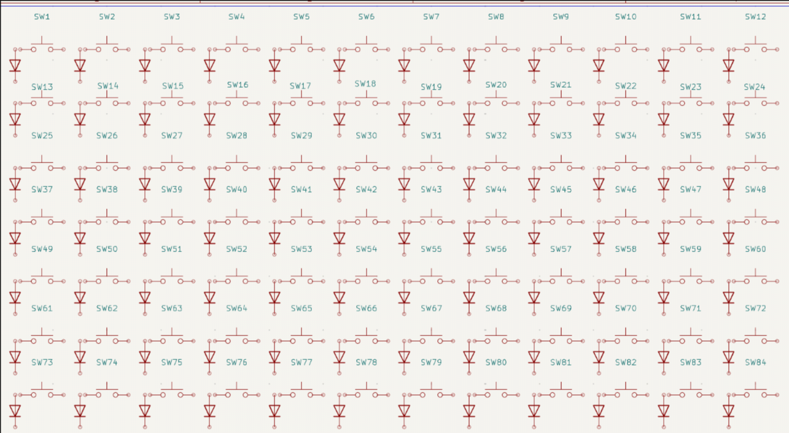
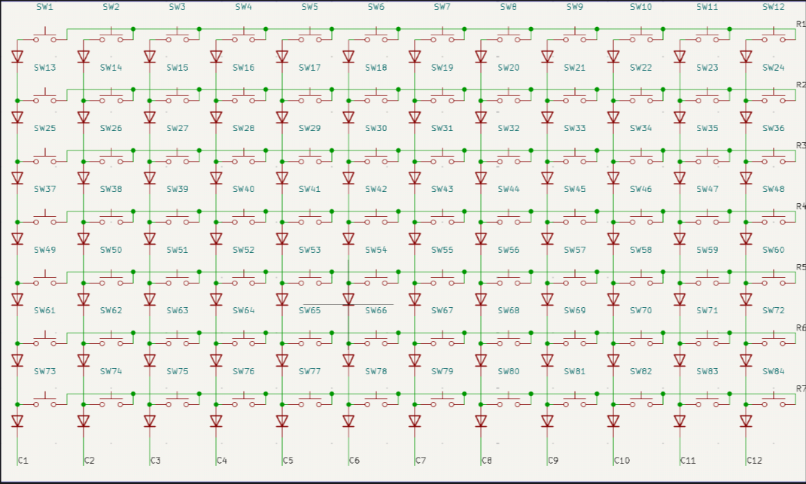
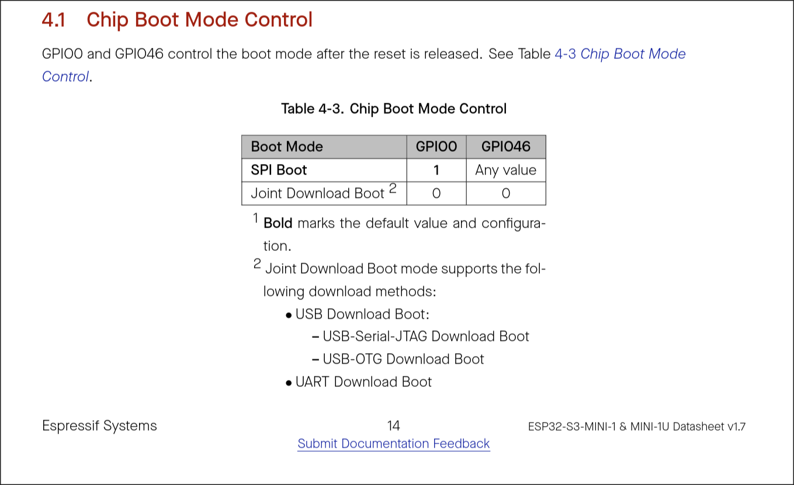
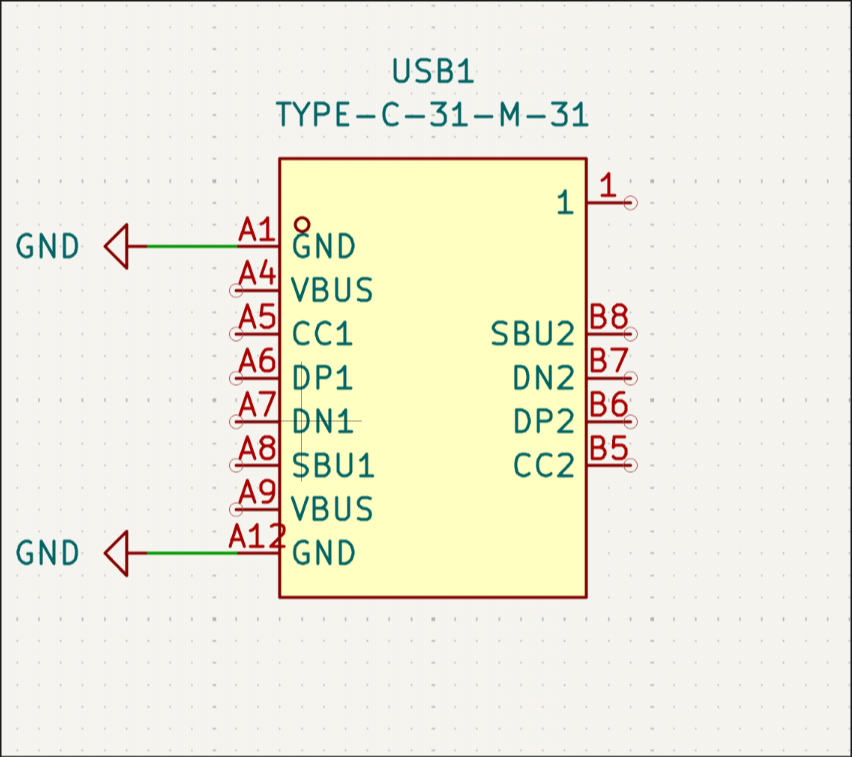
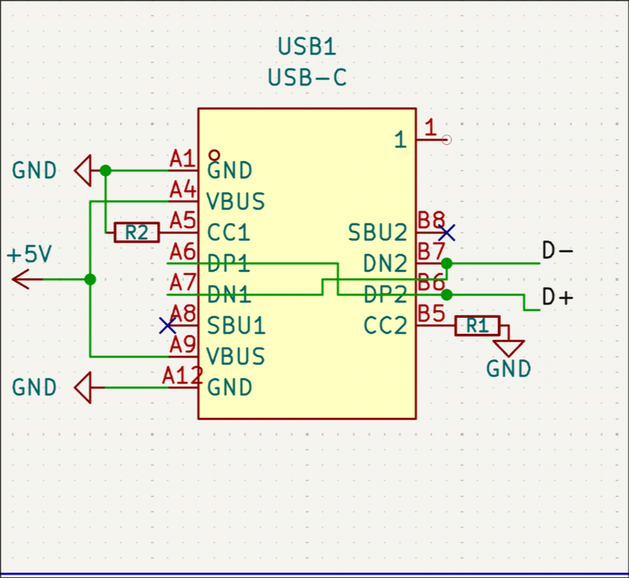
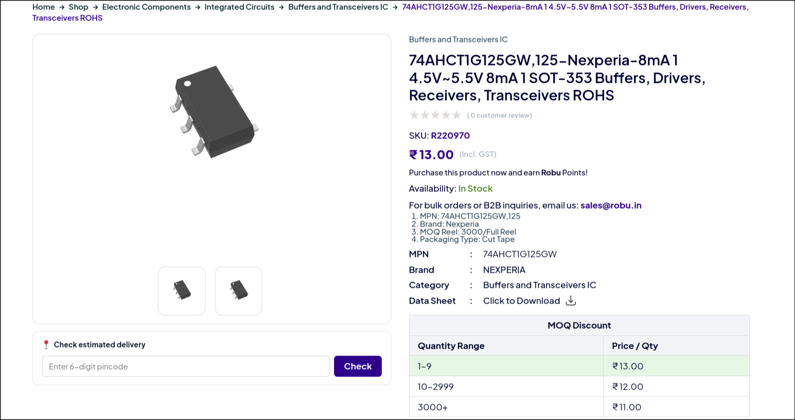
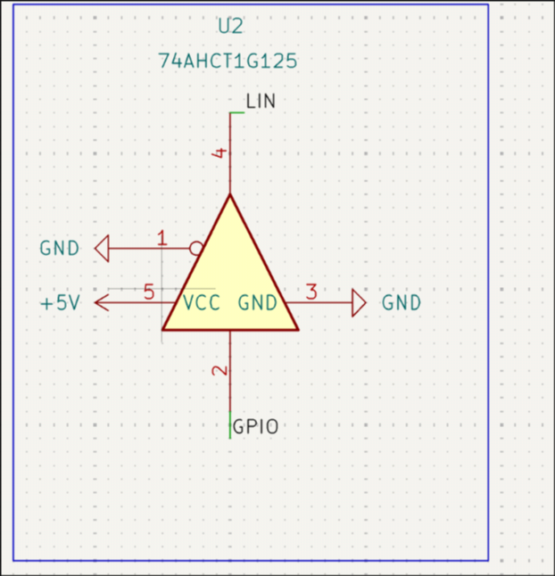
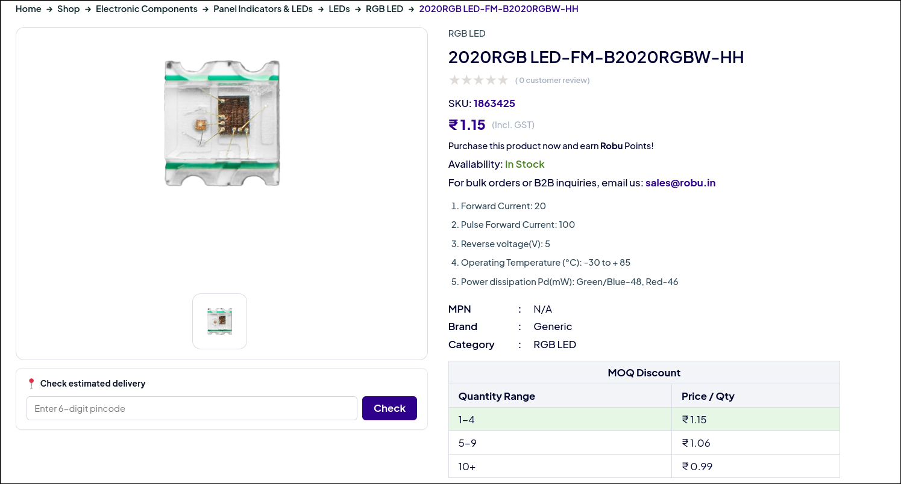
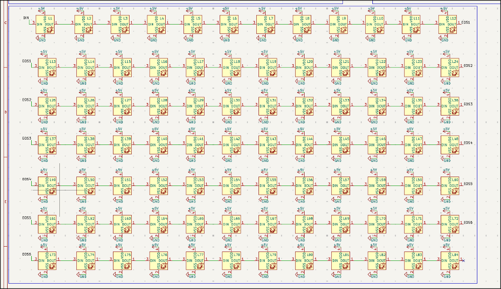

# Oct 6 

today imma gonna start the keyboard .

At first i need switches , so imma gonna find them .

After a lot of searching(likely 30+ min on alibaba and amazon ) i found a good one 

but unfortunately they didnt tag any datasheet so imma gonna use the standard outemu stich model as the dimensions match 

eos for today 

**Total time spent: 1 hours**

# Oct 7 

so today i started with the kicad side , added basic symbols and footprints for the switches only but still it isnt same as the switch in my cart , idk wht happened.

pk placed all the switchs on sch , it is currently 12x7 i placed it , idk why but it turned out

ok so now imma gonna do a really clever thing for the gpio's but its gonna need more diode nah the combination one gonna take way more diodes , i dunno wanna do tht so basic 12x7 matrix ah nah thts too basic , but lets do tht anyways .

added `1N4148W` diode for each key now connection ,

okk connected every thing up now i thing gonna add the mcu 

added the esp and read the datasheet a bit heres wht i found

the strapping pins 

so i needa pull gpio 0 low to get into dowload otherwise high and gpio45,46 floating , easy peasy 

ok added the usb c , now gotta figure out how to connect this one 

done connected the 

now i need a ic to controll the led's so i thing imma gonna use `74AHCT1G125` , this one is really cheap on robu also it is kinda popular for one gpio multi led driver , i think its a psuedo i2c or semi i2c after reading the datasheet anyways gonna use this.

---

as i said its really cheap , now gonna wire it .

i am pretty lucky , kicad had this on sym i didnt had to fetch it with easyeda2kicad lol

wired it , also lin means led in .

i tried to find the perfect led for my project a lot but it was either too expensive or needs a driver and after all i concluded adding a driver will be cheaper hmpf .

js check it out , its sooooo cheap 

where the addressable one's cost 10-14 rs each hell naw imma not gonna use those even it makes things bulky , as who wants to waste money on ic embedded led , i wd rather put a bigger ic and use i2c. 

OK I GOT A HOLY IDEA , i can use multiple `STM32F030C6T6` and then make the keyboard modular as hell i mean the stm's will do the whole led + switches works while esp
 will have each stm with i2c + the display i can literally do custom i2c for it , it will be considered the worlds most modular keyboard lol . anyways for this i will need to redesign the switch matrix , ah thts a lot of work again .

 wait isnt using stm32's for each part a bit way too much inefficient? 

 nah lets go back to the costlier `WS2812B-2020` or the cost will be equal anyways .

 ok done i was lucky tht kicad already had the sym and did the wiring , bruh it was tiring 

k enough gonna do the esp + switch matrix connection tomorrow .

**Total time spent: 3 hours**